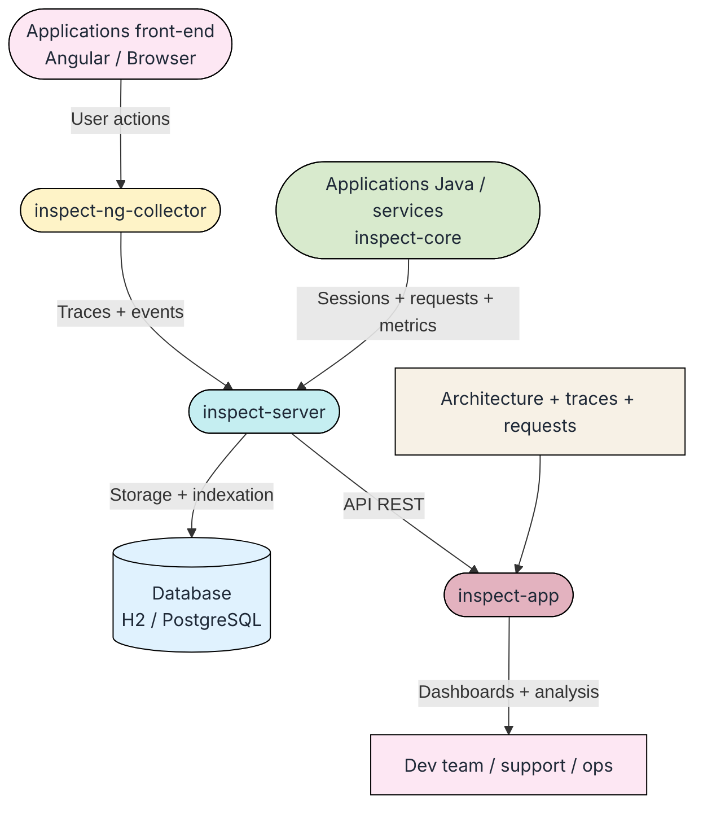
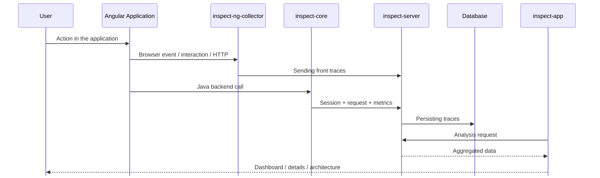

# Architecture

## Organisation

INSPECT is composed of 3 main components: the collector, the server and the application. 
The collector is responsible for collecting data from various sources, such as logs, metrics, and traces. 
The server is responsible for processing and storing the collected data, and providing a user interface for visualizing and analyzing the data. 
The application is responsible for generating the data that is collected by the collector.

## INSPECT services

## Second graph

