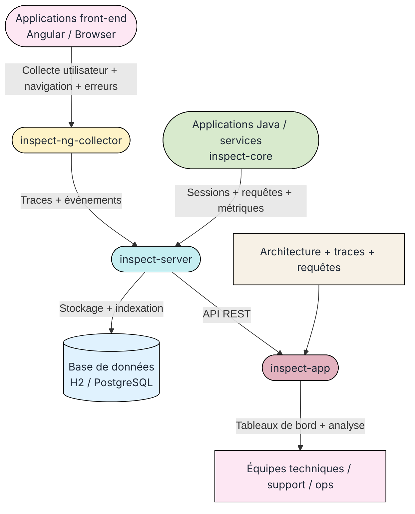
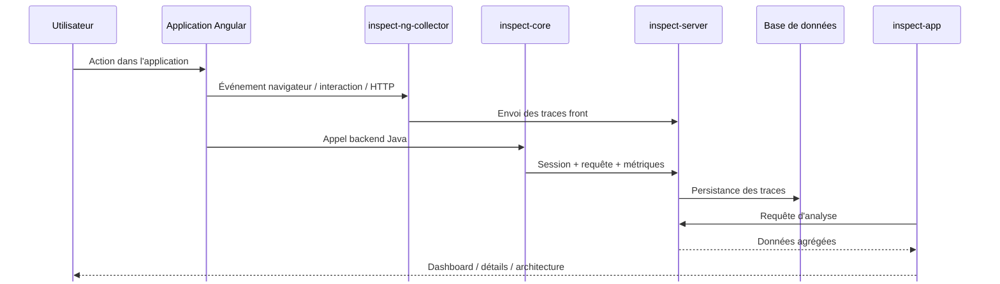

# Architecture

## Organisation

INSPECT est divisé en 3 parties :

- Les collecteurs
- Le serveur
- L'applicatif

```mermaid
  flowchart TD

  classDef IHM fill:#FDE7F3,stroke:#000000,color:#1f2937, font-family: Inter;
  classDef Angular_Collector fill:#FEF3C7,stroke:#000000,color:#1f2937, font-family: Inter;
  classDef App fill:#E3B2BF,stroke:#000000,color:#1f2937, font-family: Inter;
  classDef BDD fill:#E0F2FE,stroke:#000000,color:#1f2937, font-family: Inter;
  classDef Requests fill:#F7F1E6,stroke:#000000,color:#1f2937, font-family: Inter;
  classDef Core fill:#D8EACD,stroke:#000000,color:#1f2937, font-family: Inter;
  classDef Server fill:#C5EEF1,stroke:#000000,color:#1f2937, font-family: Inter;
  classDef Team fill:#FDE7F3,stroke:#000000,color:#1f2937, font-family: Inter;


  IHM([Applications front-end\nAngular / Browser]) -->|Collecte utilisateur + navigation + erreurs| Angular_Collector([inspect-ng-collector])
  Angular_Collector -->|Traces + événements| Server([inspect-server])

  Core([Applications Java / services\ninspect-core]) -->|Sessions + requêtes + métriques| Server
  Server -->|Stockage + indexation| BDD[(Base de données\nH2 / PostgreSQL)]
  Server -->|API REST| App([inspect-app])
  App -->|Tableaux de bord + analyse| Team[Équipes techniques / support / ops]

  Requests[Architecture + traces + requêtes] --> App

  click Core "architecture/collector"
  click App "architecture/application"
  click Server "architecture/server"

  class IHM IHM;
  class Angular_Collector Angular_Collector;
  class App App;
  class BDD BDD;
  class Requests Requests;
  class Core Core;
  class Server Server;
  class Team Team;
```

## Deuxième graphique

```mermaid
%%{init: {'sequence': {'mirrorActors': false}}}%%
sequenceDiagram
    participant U as Utilisateur
    participant A as Application Angular
    participant NG as inspect-ng-collector
    participant C as inspect-core
    participant S as inspect-server
    participant DB as Base de données
    participant UI as inspect-app

    U->>A: Action dans l'application
    A->>NG: Événement navigateur / interaction / HTTP
    NG->>S: Envoi des traces front

    A->>C: Appel backend Java
    C->>S: Session + requête + métriques
    S->>DB: Persistance des traces

    UI->>S: Requête d'analyse
    S-->>UI: Données agrégées
    UI-->>U: Dashboard / détails / architecture
```

