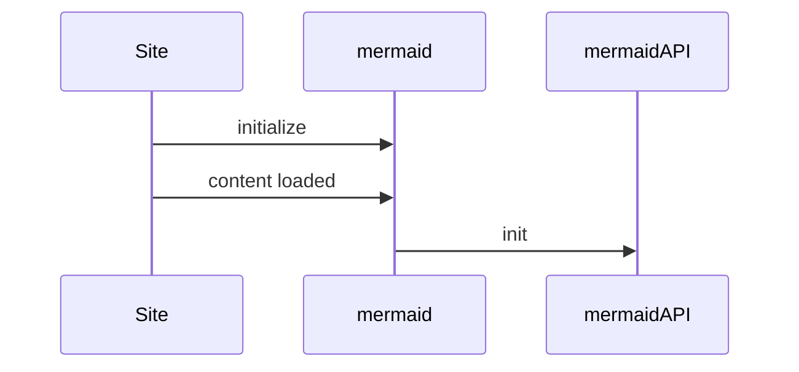

# Architecture

## Organisation

INSPECT est divisé en 3 parties :

- Les collecteurs
- Le serveur
- L'applicatif


[//]: # (```mermaid)

[//]: # (graph TD)

[//]: # (    A[Instrumented apps - Collectors ] -->|sends data| B[inspect-server])

[//]: # (    B -->|stores data| C[PostgreSQL / H2 - persistence])

[//]: # (    B -->|serves data| D[inspect-app - UI frontend])

[//]: # (```)





