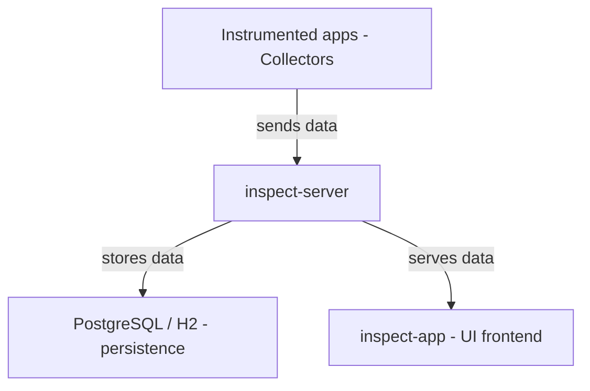

INSPECT permet d'avoir une observabilité globale de l'application, mais ce n'est qu'un point de l'outil.
Il peut monitorer, avoir le nombre de redémarrages des microservices, d'avoir les versions déployées, les branches git déployées, le sha du dernier commit

(a compléter via confluence, parler des requetes HTTP, JDBC, SMTP...)

